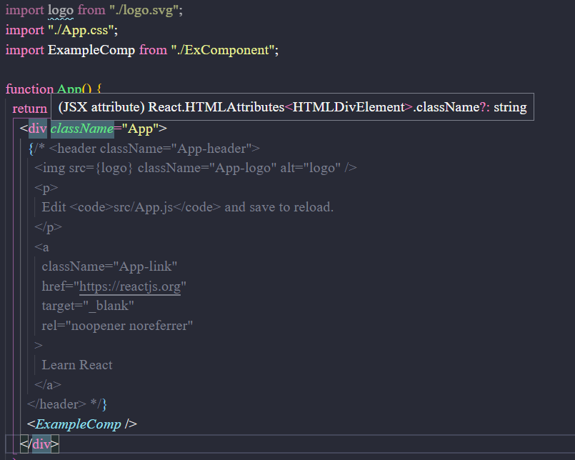

# REACT APP

# CODE RULE

1. tao component theo cau truc folder tft-v1\src\ExComponent
   --FolderName
   ----index.jsx
   -----\*.css
   -----etc

2. Rules :
   -ten folder : viet hoa chu cai dau
   -ten file : viet thuong

3. chu thich folder :
   SharedComponents : component dung chung

# CODE EXAMPLE

1. Code duoc luu tai folder ExComponent
2. Vo file App.js va lam nhu hinh sau :
   

# ROUTE EXAMPLE

1. Phai install react-router-dom:
   terminal : npm install --save react-router-dom
2. Vi project co dung file scss => cai them module sass
   npm install sass